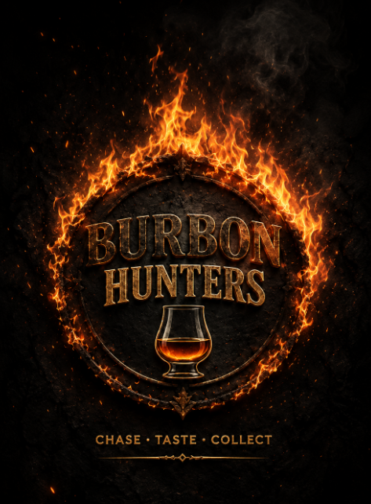

<p align="center">
  
</p>

<p align="center">
  
  
  
  
</p>

<h1 align="center">🥃 Bourbon Hunters</h1>
<p align="center"><b>DISCOVER · TRACK · HUNT</b></p>
<p align="center">PWA dla łowców bourbona: baza butelek, kolekcja, wishlist i skaner etykiet wspierany przez Hunter AI.</p>

---

## Szybkie linki

| Widok | Link |
|---|---|
| Aplikacja | [bourbon-hunters](https://backloghero-lang.github.io/bourbon-hunters/) |
| Launcher testowy | [test-index.html](https://backloghero-lang.github.io/bourbon-hunters/test-index.html) |
| Assety Home | [`design/figma-assets/asset-pack-v1`](design/figma-assets/asset-pack-v1) |
| Assety Scanner | [`design/figma-assets/scanner-pack-v1`](design/figma-assets/scanner-pack-v1) |
| Figma importer | [`design/figma-import-plugin`](design/figma-import-plugin) |

## Test na komputerze

Stały launcher testowy jest dostępny jako [`test-index.html`](https://backloghero-lang.github.io/bourbon-hunters/test-index.html).

Po deployu kliknij w nim `Odswiez build`. Launcher dodaje cache-busting do aplikacji, pokazuje aktualną wersję service workera i pozwala wyczyścić cache/PWA bez grzebania w DevTools.

## Asset pipeline

Projekt ma prosty pipeline dla assetów: GitHub przechowuje pliki produkcyjne, a Figma służy jako katalog wizualny i miejsce projektowania ekranów.

| Paczka | Zawartość | Pliki | Ścieżka |
|---|---|---:|---|
| Home Asset Pack v1 | header, logo, search, featured card, kategorie, bottom nav, efekty | 24 | [`design/figma-assets/asset-pack-v1`](design/figma-assets/asset-pack-v1) |
| Scanner Pack v1 | tło skanera, ramka, scan beam, przyciski, overlay analizy, badges, stany | 26 | [`design/figma-assets/scanner-pack-v1`](design/figma-assets/scanner-pack-v1) |

Assety są publikowane przez GitHub Pages, więc aplikacja i Figma używają tych samych plików. Import do Figmy robi lokalny plugin:

```text
design/figma-import-plugin/manifest.json
```

W Figmie uruchom:

```text
Plugins → Development → Bourbon Hunters Asset Importer
```

Plugin tworzy albo odświeża strony:

- `Home Pack v1 - Imported`
- `Scanner Pack v1 - Imported`

Po dodaniu nowej paczki: wrzuć assety do repo, uruchom `WYSLIJ-NA-GITHUB.bat`, odczekaj chwilę na GitHub Pages i ponownie uruchom importer w Figmie.

## 🎯 Co potrafi (dziś)

**Skaner butelek z bazą 539 bourbonów i 539 lokalnych zdjęć.** Robisz zdjęcie etykiety, a agent **Hunter**:

1. 🔍 rozpoznaje butelkę,
2. 📚 **najpierw sprawdza lokalną bazę** `db/bourbons.json` — odpowiedź jest natychmiastowa i darmowa,
3. 🌐 jeśli butelki nie ma w bazie → dopiero wtedy pyta sieci, a znalezisko zapisuje jako **nowość** (do późniejszego uzupełnienia o zdjęcie przez agenta cyklicznego).

Dwa tryby (dwa przyciski):

| Przycisk | Co robi |
|---|---|
| ⭐ **Ocena** | gwiazdki **jakość/cena** (5★ = świetna i tania, 1★ = kiepska i droga), profil smaku, cena orient. PLN |
| 🔎 **Analiza AI** | rozbudowany opis + **historia destylarni** z linkami |

Język **dobiera się do telefonu** (PL/EN). Instalowalna PWA, działa offline. Klucz AI jest ukryty w Cloudflare Workerze.

## 🗺️ Plan (etapami)

| Etap | Zakres | Status |
|---|---|---|
| A | 🔫 Skaner butelek (zdjęcie → ocena) | ✅ gotowe |
| B | Szkielet nawigacji + ekran HOME (liczniki) | ⏳ |
| C | Moja kolekcja + zapis butelek | ⏳ |
| D | Przeglądaj whisky + szczegóły | ⏳ |
| E | Mapa destylarni, odznaki, notatki | ⏳ |

Pełne notatki projektowe i paleta: `design/DESIGN.md`.

## 🏗️ Architektura

```
[Telefon / PWA]  ──zdjęcie──►  [Cloudflare Worker]  ──►  [Hunter AI + web search]
   index.html                     worker.js                rozpoznanie + recenzje + cena
        ▲                            │
        └──── JSON: ocena, opis, źródła ◄──────────────────────────────────────────────┘
```

- **Front:** `index.html` + `manifest.json` + `sw.js` (GitHub Pages).
- **Backend:** `agent/worker.js` — chowa klucz AI, woła Huntera z wyszukiwarką, limituje zapytania.
- **Prompt:** `agent/prompt.txt` — edytujesz i commitujesz, Worker sam podciąga.

## 🚀 Uruchomienie

Instrukcja krok po kroku: **`INSTRUKCJA.md`**.

## 🧪 O projekcie

Projekt weekendowy, **vibe-coded z Claude**. — [Dariusz Masłyk](https://www.linkedin.com/in/dariusz-maslyk)

> ⚠️ Ceny i oceny są orientacyjne. Pij odpowiedzialnie. 18+
