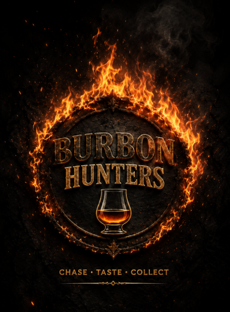

<p align="center">
  
</p>

<p align="center">
  
  
  
  
</p>

<h1 align="center">Bourbon Hunters</h1>
<p align="center"><b>DISCOVER - TRACK - HUNT</b></p>
<p align="center">Premium PWA prototype for bourbon discovery, bottle scanning, wishlist, collection tracking and account sync.</p>

---

## Quick Links

| View | Link |
|---|---|
| App | [bourbon-hunters](https://backloghero-lang.github.io/bourbon-hunters/) |
| Test launcher | [test-index.html](https://backloghero-lang.github.io/bourbon-hunters/test-index.html) |
| Project docs | [`pliki-md`](pliki-md) |
| Figma importer | [`design/figma-import-plugin`](design/figma-import-plugin) |
| Worker | [`agent/worker.js`](agent/worker.js) |
| D1 schema | [`agent/d1-schema.sql`](agent/d1-schema.sql) |

## What It Does Today

The scanner reads a bottle label photo and asks Hunter to match it against the bourbon database.

Current quality rule:

1. Hunter recognizes the bottle name from the photo.
2. The Worker checks `db/bourbons.json` first.
3. A normal result is shown only when match confidence is at least 80%.
4. Lower-confidence scans do not return a random bottle. They show the planned `Hunter AI Plus` state.

| Feature | Status |
|---|---|
| Fast rating | Database-first result with price/value and tasting profile |
| Bottle details | Concise varied general info plus nose, taste and finish |
| AI analysis | Deeper description for confident matches |
| Hunter AI Plus | Planned Pro feature for deeper matching, web search, profile creation and saving new finds |
| Accounts | Email/password through Cloudflare Worker + D1 |
| Account sync | Wishlist, collection, user ratings and scan history |
| Username validation | Duplicate username detection with generated suggestions |
| Password reset | UI, Worker endpoint and Resend email flow ready |
| Transactional email | Resend-ready welcome and password reset emails |
| Google Sign-In | OAuth through Google and the Cloudflare Worker |
| Age gate | Entry gate before intro plus date of birth at registration |
| Community catalog | Confirmed scan-index matches can be published to D1 with an optional user-approved bottle cutout |

## Architecture

```text
Phone / PWA -> Cloudflare Worker -> database match / Hunter AI
index.html     agent/worker.js      D1, R2, Images, KV, whisky catalog
```

- Frontend: `index.html`, `manifest.json`, `sw.js`.
- Backend: `agent/worker.js` on Cloudflare Workers.
- User data: Cloudflare D1 for accounts, sessions, wishlist, collection, ratings and scan history.
- D1 migrations: run `agent/d1-schema.sql` for a fresh database. Existing databases use the numbered migrations through `agent/d1-migration-v64-catalog-submissions.sql`.
- Static hosting: GitHub Pages.
- Project docs and planning files: `pliki-md/`.
- Figma asset importer code: `design/figma-import-plugin/`.

## Current Backend Notes

- Registration requires email, password, username and date of birth.
- Passwords are stored as PBKDF2 SHA-256 hashes with salt, never as plain text.
- The Worker exposes `/auth/health` for a quick D1/schema check.
- Transactional emails use Resend when `RESEND_API_KEY` and `MAIL_FROM` are configured. Welcome, password reset and data deletion templates live in `pliki-md/email-templates/`.
- Current Worker health reports auth, scanner/catalog versions, individual D1 schema flags, Google/email readiness and image-pipeline readiness.
- User-approved bottle cutouts use an Images binding named `IMAGES` and a private R2 bucket binding named `BOTTLE_IMAGES`.

## Community Catalog Deployment

1. Run `agent/d1-migration-v64-catalog-submissions.sql` against the existing D1 database.
2. Create or select a private R2 bucket and bind it to the Worker as `BOTTLE_IMAGES`.
3. Add a Cloudflare Images binding named `IMAGES`.
4. Replace/deploy `agent/worker.js`.
5. Publish the frontend through GitHub Pages and refresh the installed PWA so cache `bourbon-hunters-v81` is active.
6. Verify `/auth/health`: `catalog_schema`, `image_pipeline_ready`, `d1` and the existing schema flags should all be `true`.

## Project Direction

This public repo is a showcase/prototype. The commercial version should move into a private production repo before adding paywall, Google Play release work, advanced AI Plus logic, image storage and business integrations.

## Responsible Use

Prices and ratings are approximate. Drink responsibly. 18+ / 21+ where required by law.
