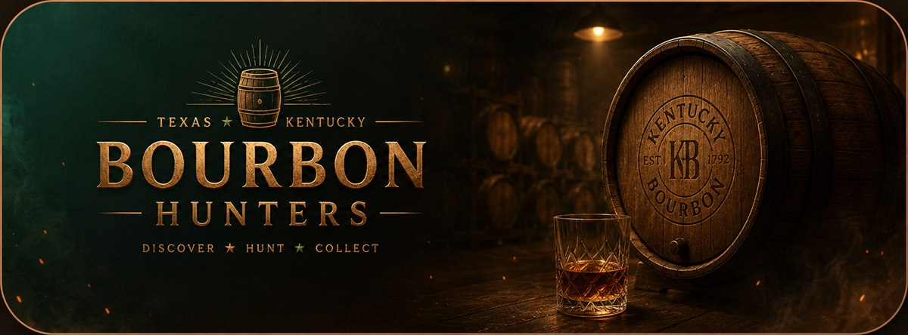

  

<h1 align="center">Bourbon Hunters</h1>

<strong>ODKRYWAJ · SKANUJ · KOLEKCJONUJ</strong>

Mobilny kompan dla fanów dobrych alkoholi. Rozpoznaj butelkę po etykiecie, poznaj jej charakter i zbuduj własną kolekcję.

  
  
  

  

## Twoja butelka. Twoje odkrycie.

Bourbon Hunters powstało dla osób, które lubią odkrywać bourbon, whisky i inne ciekawe butelki bez przekopywania dziesiątek stron. Robisz zdjęcie przedniej etykiety smartfonem, potwierdzasz trafienie i otrzymujesz uporządkowane informacje przydatne przed zakupem oraz podczas poznawania własnej kolekcji.

| Odkrywaj | Kolekcjonuj | Wracaj po więcej |
|---|---|---|
| Skanuj etykiety i rozpoznawaj butelki | Dodawaj butelki do swojej kolekcji | Czytaj wybrane newsy ze świata whisky |
| Sprawdzaj moc, cenę i profil smaku | Buduj listę życzeń na kolejne łowy | Oceniaj i polecaj butelki społeczności |
| Poznawaj nos, smak, finisz i najważniejsze informacje | Uzupełniaj brakujące zdjęcia produktów | Synchronizuj dane po zalogowaniu |

## Skaner etykiet

Wersja demonstracyjna korzysta z katalogu 200 butelek.
Aplikacja jest dostępna już w darmowym planie po zalogowaniu. 
Skaner analizuje zdjęcie przedniej etykiety i porównuje je z katalogiem produktów. Niepewne lub niejednoznaczne odczyty nie są przedstawiane jako pewne trafienie i wymagają ponownego zdjęcia.

Po potwierdzeniu aplikacja prezentuje między innymi:
- nazwę i rodzaj alkoholu;
- destylarnię oraz region pochodzenia;
- moc wyrażoną jako ABV i proof;
- sugerowany przedział cenowy;
- opis ogólny, nos, smak i finisz;
- ocenę społeczności oraz własną ocenę użytkownika.

Ważne: Jeżeli produkt nie ma jeszcze zdjęcia, aplikacja może przygotować wycięty i wycentrowany obraz butelki na podstawie fotografii użytkownika. Wynik jest pokazywany do akceptacji przed zapisaniem.

## Kolekcja i lista życzeń

Zalogowany użytkownik może budować własną kolekcję, zapisywać butelki na liście życzeń, wystawiać oceny i dodawać rekomendacje. Dane są synchronizowane z kontem, dzięki czemu pozostają dostępne na różnych urządzeniach.

## Newsy i artykuły

Sekcja newsów jest dostępna po zalogowaniu. Dwa razy w tygodniu aplikacja publikuje wybór trzech wartościowych materiałów ze świata bourbonu i whisky.

Każda pozycja zawiera:

- tytuł i miniaturę artykułu;
- krótkie streszczenie skupione na najważniejszych informacjach;
- nazwę źródła i datę publikacji;
- bezpośredni odnośnik do oryginalnego artykułu.

Starsze materiały są automatycznie usuwane po miesiącu, a mechanizm wykrywania duplikatów zapobiega ponownemu publikowaniu tych samych linków.

## Trzech agentów AI

Bourbon Hunters wykorzystuje wyspecjalizowanych agentów AI, z których każdy odpowiada za inny obszar aplikacji.

### 1. Agent skanera

Analizuje fotografię etykiety, porównuje cechy wizualne z katalogiem, porządkuje kandydatów według pewności dopasowania i przekazuje użytkownikowi wynik do potwierdzenia. Wspiera także przygotowanie zdjęcia produktu, gdy w katalogu brakuje gotowego assetu.

### 2. Agent newsów

Przeszukuje zaufane serwisy branżowe, wybiera wartościowe publikacje, sprawdza źródła, usuwa duplikaty i przygotowuje krótkie streszczenia. Nowe materiały pojawiają się zgodnie z harmonogramem w poniedziałki i czwartki.

### 3. Agent wersji Pro

Rozwijany agent Pro będzie przygotowywał rozszerzoną analizę AI dopasowaną do konkretnej butelki. W planach znajdują się:

- ciekawostki o destylarniach, producentach i historii marek;
- dodatkowe informacje o butelkach, edycjach i metodach produkcji;
- pogłębiona analiza profilu oraz charakteru alkoholu;
- informacje, gdzie można szukać trudno dostępnych butelek;
- wsparcie w odnajdywaniu produktów alokowanych, czyli limitowanych butelek przydzielanych sklepom w niewielkich ilościach;
- wyższe limity skanowania oraz korzystanie z aplikacji bez reklam.

Wersja Pro jest obecnie w budowie. Zakres funkcji może być rozwijany wraz z kolejnymi wydaniami aplikacji.

## Profil łowcy

- logowanie za pomocą adresu e-mail lub konta Google;
- własny znacznik widoczny przy komentarzach i poleceniach;
- synchronizowana kolekcja, lista życzeń, oceny i recenzje;
- ustawienia profilu oraz narzędzia ochrony danych;
- podgląd aktywności użytkownika w jednym miejscu.

## Film instruktażowy

Film pokazujący prawidłowe wykonanie zdjęcia i pełną drogę butelki od skanowania do kolekcji pojawi się wkrótce.

## Wypróbuj Bourbon Hunters

| | |
|---|---|
| Aplikacja | [backloghero-lang.github.io/bourbon-hunters](https://backloghero-lang.github.io/bourbon-hunters/) |
| Wersja testowa | [test-index.html](https://backloghero-lang.github.io/bourbon-hunters/test-index.html) |
| Instrukcja wdrożenia | [`pliki-md/INSTRUKCJA.md`](pliki-md/INSTRUKCJA.md) |
| Aktualny dokument przekazania | [`pliki-md/HANDOFF.md`](pliki-md/HANDOFF.md) |

Projekt rozwijany jako aplikacja PWA przeznaczona dla pełnoletnich użytkowników. Ceny i oceny są orientacyjne. Pij odpowiedzialnie.

